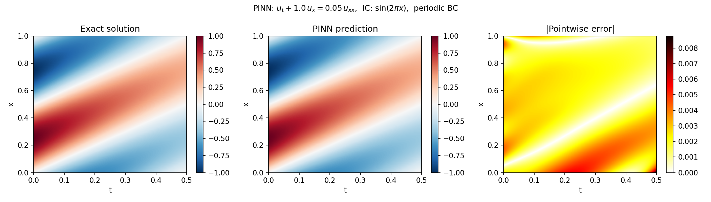
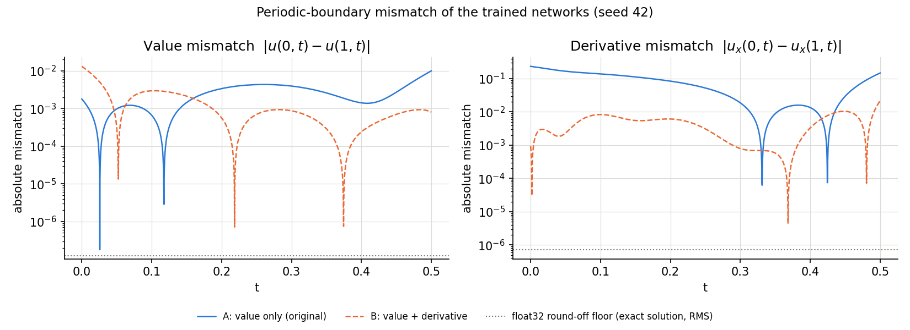
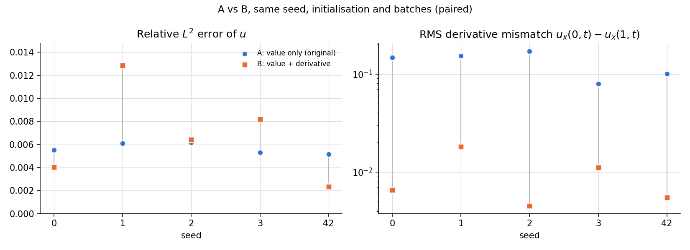

# PINN for the 1D Advection-Diffusion Equation

A Physics-Informed Neural Network (PINN) implemented in PyTorch for the 1D advection-diffusion PDE:

$$u_t + c\,u_x = \nu\,u_{xx}, \quad x \in [0,1],\; t \in [0, T], \qquad c = 1,\; \nu = 0.05,\; T = 0.5$$

with initial condition $u(x,0) = \sin(2\pi x)$ and periodic boundary conditions $u(0,t) = u(1,t)$ and $u_x(0,t) = u_x(1,t)$.

The exact solution is:

$$u(x,t) = e^{-\nu(2\pi)^2 t}\,\sin\!\bigl(2\pi(x - ct)\bigr)$$

## Approach

The PDE residual, initial condition loss, and boundary condition loss are enforced simultaneously during training via automatic differentiation (no labelled interior data required):

$$\mathcal{L} = \underbrace{\frac{1}{N_r}\sum_i r(x_i,t_i)^2}_{\text{PDE residual}} + \underbrace{\frac{1}{N_0}\sum_j (u_\theta(x_j,0) - \sin(2\pi x_j))^2}_{\text{IC loss}} + \underbrace{\frac{1}{N_b}\sum_k (u_\theta(0,t_k) - u_\theta(1,t_k))^2}_{\text{BC loss, value}} + \underbrace{\frac{1}{N_b}\sum_k (u_{\theta,x}(0,t_k) - u_{\theta,x}(1,t_k))^2}_{\text{BC loss, derivative}}$$

where $r = u_t + c\,u_x - \nu\,u_{xx}$ and $u_{\theta,x}$ are computed by automatic differentiation through the network. All four terms have weight 1.

The PDE is second order in $x$, so the periodic problem needs two conditions at the boundary, value and derivative continuity. (Given $u$ periodic, $u_x$ periodic is equivalent to periodicity of the total flux $c\,u - \nu\,u_x$, since $\nu > 0$.)

Two formulations are kept in the code:

| | Periodic boundary loss | Selected by |
|---|---|---|
| **A** (original) | value term only | `python pinn.py --bc value`, `train(derivative_bc=False)` |
| **B** (corrected) | value term + derivative term | `python pinn.py` (default), `train(derivative_bc=True)` |

The first version of this repository used A. B adds the derivative term and changes nothing else: same network, initialisation, sampling, optimiser, schedule, iterations and loss weights for a given seed.

B is the default because it states the intended periodic second-order spatial problem correctly, not because it is more accurate (see the results below). A remains available for reproducing the historical experiment.

## Architecture

- Fully connected network: input $(x,t)$ → 4 hidden layers (width 64, tanh) → scalar $u$
- Trained with Adam (15 000 iterations, learning rate $10^{-3}$, step decay)
- 2000 PDE collocation points, 200 IC points, 100 BC points per batch (resampled every iteration)

## Results

All numbers below are from `results/` and were computed after training by `diagnostics.py`, independently of the training loss. The relative $L^2$ error is over a 300 × 150 space-time grid. Mean ± sample standard deviation over five seeds (42, 0, 1, 2, 3), with A and B paired on seed.

### Historical formulation A (value periodicity only)

Relative $L^2$ error **5.140 × 10⁻³** for seed 42, the originally reported ~5 × 10⁻³. A from-scratch 15 000-epoch retrain of the original code (CPU, 136 s) reproduced this value and regenerated `pinn_result.png` byte for byte. Over the five seeds at 15 000 epochs, relative $L^2$ is 5.64 × 10⁻³ ± 0.46 × 10⁻³ (range 5.1 to 6.2 × 10⁻³) and the RMS derivative mismatch $u_x(0,t) - u_x(1,t)$ is 0.131. This is a correct measurement of the value-only formulation; what it did not measure was the derivative condition.



### Corrected formulation B at the fixed 15 000-epoch budget (primary controlled comparison)

The comparison was fixed in advance: five seeds, 15 000 epochs, unit loss weights, no tuning. Data: `results/ab_results.json`, `results/ab_results.csv`.

| Metric | A: value only | B: value + derivative |
|---|---|---|
| RMS of $u_x(0,t) - u_x(1,t)$ | 1.31e-1 ± 3.8e-2 | 9.2e-3 ± 5.6e-3 |
| Relative $L^2$ error of $u$ | 5.64e-3 ± 0.46e-3 | 6.76e-3 ± 4.07e-3 |
| PDE residual, RMS on fixed grid | 3.9e-3 ± 0.9e-3 | 1.05e-2 ± 0.2e-2 |
| Initial-condition error, RMS | 3.3e-3 ± 0.5e-3 | 5.9e-3 ± 1.8e-3 |
| RMS of $u(0,t) - u(1,t)$ | 4.1e-3 ± 1.1e-3 | 3.7e-3 ± 1.1e-3 |
| Runtime per run (sequential, CPU) | 148 s | 164 s |

- The derivative mismatch falls in every seed, by 7 to 38 ×. The value-only mismatch is 2 to 6 % of the RMS of the exact $u_x$ (float32 round-off level of the exact solution: about 7 × 10⁻⁷).
- There is no reliable improvement in global $L^2$ accuracy. B is lower than A for two seeds (42, 0) and higher for three (1, 2, 3), and its spread is much larger (2.3 to 12.8 × 10⁻³ against 5.1 to 6.2 × 10⁻³).
- The PDE residual is higher for B (1.05 × 10⁻² against 3.9 × 10⁻³, 2.7 times; per seed 1.9 to 3.4 times) and so is the initial-condition error.
- B costs about 11 % more time per run.





### Post-hoc 30 000-epoch diagnostic (not the primary comparison)

B's PDE loss was still decreasing at 15 000 epochs, so after seeing the primary result the same code and schedule were rerun with only the epoch count doubled. This was decided after the fact, on five seeds, and is a diagnostic of the optimisation budget, not a benchmark. Data: `results/ab_results_30000epochs.json`, `results/ab_results_30000epochs.csv`. Runtimes in that file are not comparable with the 15 000-epoch file because the A and B runs shared the CPU.

| Metric | A, 30 000 epochs | B, 30 000 epochs |
|---|---|---|
| RMS of $u_x(0,t) - u_x(1,t)$ | 1.06e-1 ± 3.8e-2 | 4.0e-3 ± 1.0e-3 |
| Relative $L^2$ error of $u$ | 4.75e-3 ± 1.8e-3 | 2.18e-3 ± 0.70e-3 |
| PDE residual, RMS on fixed grid | 2.7e-3 ± 1.0e-3 | 6.7e-3 ± 0.5e-3 |

This suggests that B benefits from additional optimisation budget: B is lower than A for four seeds and tied for one (paired differences −1.4, −5.2, −3.7, −2.7, −0.02 × 10⁻³), and the value-only derivative mismatch is not removed by the extra training. It does not establish convergence or a general accuracy improvement, and the 30 000-epoch $L^2$ values are not the reported result of this project.

### Interpretation

The corrected loss enforces the intended periodic derivative condition and reduces the corresponding boundary mismatch substantially and consistently. At the original fixed training budget, this mathematical correction does not translate into a reliable improvement in global $L^2$ accuracy and increases the measured PDE residual, indicating an unresolved optimisation and loss-balancing trade-off.

## Limitations

- One PDE, one smooth low-frequency initial condition, one network size, unit loss weights that were not tuned, and five seeds. Nothing here says how the two formulations compare for sharper solutions or other coefficients.
- The boundary conditions are soft constraints. In every run of either formulation the RMS value mismatch is between 0.8 × 10⁻³ and 5.3 × 10⁻³.
- The comparison of $L^2$ errors depends on the training budget, and only two budgets were run. Convergence was not demonstrated.
- B's higher PDE residual is unexplained. Loss weighting and optimisation of the additional term are possible subjects for future work; no weights were tuned here.
- The earlier statement in this README that omitting the derivative term was empirically inconsequential was not backed by a derivative-mismatch measurement. The diagnostics above show a mismatch of a few percent of the exact $u_x$ scale, although the reported $L^2$ error of $u$ was small.

## Usage

```bash
pip install -r requirements.txt
python pinn.py                  # formulation B; writes pinn_result_value_derivative.png
python pinn.py --bc value       # formulation A (original); writes pinn_result.png
```

Reproduce the comparison and figures (about 25 min for five seeds at 15 000 epochs on a laptop CPU):

```bash
python run_ab.py --seeds 42 0 1 2 3 --work-dir runs --out results/ab_results.json
python run_ab.py --seeds 42 0 1 2 3 --epochs 30000 --work-dir runs30k --out results/ab_results_30000epochs.json
python plot_ab.py --results results/ab_results.json --work-dir runs --out-dir results
```

Tests (need `pytest`): `python -m pytest tests -q`. They check the boundary loss terms, the autograd connection of $u_x$, that the exact solution satisfies the PDE and both periodicity conditions, the relative-error formula, and that `derivative_bc=False` reproduces the original training loop exactly.
